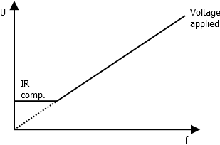

# Hoverboard firmware
This document is part of the hoverboard firmware documentation.

## Control
This document describes the control schemes used.

### V/f control
V/f control is the simplest control method. The basic idea is that the amplitude of the 
permanent magnet motor back-EMF depends linearly on the motor speed. To keep the motor flux 
constant, the input voltage amplitude is also varied linearly with rotation speed.

Because of resistances and other losses of the motors, the voltage cannot be ramped to zero 
at low speeds, but the voltage must decrease slower when approaching zero. This is typically 
called IR compensation (current*resistance). Easiest way to achieve this is to keep the 
applied voltage at a constant level below some pre-defined frequency.

## Copyright
Copyright (C) 2019 Lauri Peltonen
