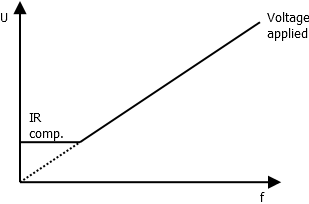

# Hoverboard firmware
This document is part of the hoverboard firmware documentation.

## Control
This document describes the control schemes used.

There are several different control modes currently available. The most common ones, 
torque and speed control, are available on all modulation modes while the two others, 
which are mainly  intended for debugging, are for SVM modulation. The modulation 
modes are shortly described here, for further explanation, refer to 
[modulation documentation](modulation.md).

### BLDC modulation
BLDC control is one of the simplest ways to control a permanent magnet motor. In BLDC control 
the motor has hall effect switches that are used to sense the rotor position, and according 
to the position, a voltage is applied. The sensor feedback and the voltage applies is matched 
such that the motor current will be in correct phase relative to the motor back-emf and as a result,
torque is generated.

This method is simple since it needs no complex control algorithm, just position sensing which 
determines which phases are energized. The torque amplitude can be controlled by using PWM to 
reduce the applied (effective) voltage and thus current. Downside is that the torque generated 
is not constant over the rotation period and the current is not accurately at correct phase with the 
back-emf which lowers the efficiency and causes vibration and noise in the motor.

### Space Vector Modulation
Space vector modulation (SVM) is a method to generate a 3-phase voltage that has a desired 
amplitude and phase angle. In the context of motors, it is often used to describe a way to generate 
a sinusoidal voltage and current for the motor, which compared to the BLDC modulation, produced smoother 
torque and less noise. With SVM, it is necessary to know exactly what voltage phase angle to produce, 
so a more accurate rotor position estimation is needed than in BLDC modulation. Often this is
generated with the help of HALL effect sensors.

### Field-Oriented Control
In field oriented control (FOC) the voltage applied to the motor is controlled in such a manner that 
the current produced is sinusoidal and in phase with the back-emf of the motor. If correctly 
applied, the torque produced is very constant and the motor efficiency is high and noise low. 
Usually FOC algorith is used together with SVM, such that the FOC algorithm outputs the desired 
voltage amplitude and phase, which the space vector modulator implements.

FOC can be either sensored or sensorless. In sensored control the hall effect sensors are used 
to determine the rotor position (and speed) while in sensorless control, current measurement 
is used as feedback from the control, and together with a motor model it is used to estimate the 
rotor position.

## Control modes
For each modulation type seleced, few options for the control mode can be selected. They are 
described next.

### Torque control
Torque control is available in all motor modes. In this mode, the reference given will represent 
the torque generated in the motor.

In BLDC and SVM mode the given reference will affect the voltage amplitude applied to the motor. 
This does not directly represent the actual torque produced, but will result in similar effect as 
a torque reference. For example, with no load and torque reference applied, the motor will speed up 
to a point where the applied voltage and motor's back emf are equal, and applying a load will slow 
down the motor. The current through the motor will vary depending on the load.

In FOC mode the torque reference affects the quadrature axis current, which means the torque 
producing current. This means that the torque the motor produces is not affected by the motor's 
speed and the current applied to the motor is constant.

### Speed control
Speed control is built on top of the torque control by an additional control loop and is available 
in all modulation modes. The speed control loops takes the measured speed and compares it to 
the reference speed given, and controls the torque reference in such a way that the desired 
speed is achieved.

### U/F control
U/F control, which means voltage/frequency control, is only available in SVM mode and is an open-loop 
control method where a speed reference is given, and the voltage applied will depend directly on the 
speed. The basic idea is that the amplitude of the 
permanent magnet motor back-EMF depends linearly on the motor speed. To keep the motor flux 
constant, the input voltage amplitude is also varied linearly with rotation speed.

Because of resistances and other losses of the motors, the voltage cannot be ramped to zero 
at low speeds, but the voltage must decrease slower when approaching zero. This is typically 
called IR compensation (current*resistance). Easiest way to achieve this is to keep the 
applied voltage at a constant level below some pre-defined frequency.

This mode is very sensitive to motor parameters, as too high or low nominal voltage, for example, 
will result in over- or undermagnetization and excess current in the motor. This mode should 
only be used for testing if open-loop control is needed.

### Angle control
Angle control is available only in SVM mode and is intended for testing and debugging only. In this 
mode the applied voltage is the IR compensation minimum voltage and the reference is the voltage 
phase angle. This mode is open-loop andcan be used to debug for example HALL sensors or current 
measurement.

## Copyright
Copyright (C) 2019 Lauri Peltonen
