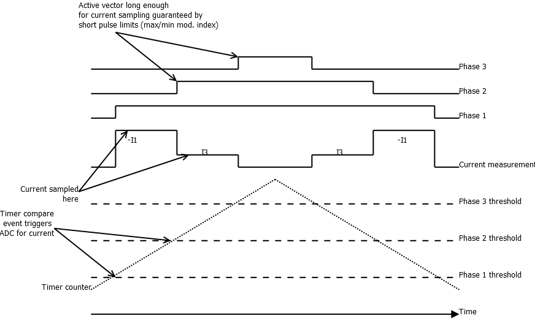

# Hoverboard firmware
This document is part of the hoverboard firmware documentation.

## Current measurement
Operation of the current measurement is described here.

### Electronics
In the hoverboard electronics, both motors drivers contain current measurement. The 
measurement is done by a shunt resistor in the bottom branch, connected such that 
the sources of the lower leg transistors are connected together to one terminal of 
the resistor and the other terminal of the resistor is connected to the battery negative.

The voltage over the shunt resistor is then fed to an operational amplifier. The signal has 
a small positive offset applied to it (approximately 140 mV), which allows for bipolar current 
measurement. The operational amplifier has voltage gain of 11, and because the current shunt 
resistor is two 7 mOhm resistors in parallel (= 3.5 mOhm), the total gain is 0.0385 V/A.

The small offset applied to the input signal centers the output to about 1.54 V and if the 
rail-to-rail measurement range is 0 ... 3.3 V, the measurement range is then -38.46 ... 45.71 A.
In reality we can probably expect around +-35 A.

### Measurement method
Because only one shunt resistor is used per motor, the phase current measurement becomes difficult. 
However, with space vector modulation it is possible if done carefully. The method is described
in for example [this document from Texas Instruments](http://www.ti.com/lit/ug/tiducy7/tiducy7.pdf).

First, we assume that the system is symmetric, i.e. the sum of all phase currents is zero. 
Then, for different switch combinations (phase A, B and C) we can derive that the shunt current is

| A | B | C | Current    |
|:-:|:-:|:-:|------------|
| 0 | 0 | 0 | -          |
| 1 | 0 | 0 | Ib+Ic=-Ia  |
| 0 | 1 | 0 | Ia+Ic=-Ib  |
| 1 | 1 | 0 | Ic         |
| 0 | 0 | 1 | Ia+Ib=-Ic  |
| 1 | 0 | 1 | Ib         |
| 0 | 1 | 1 | Ia         |
| 1 | 1 | 1 | -          |

It can be seen that current cannot be measured during zero vectors and if two different active 
vectors are used (which are separated only by one turn of a switch) then two different currents 
can be measured. The third current can then be calculated as the sum is zero.

For this method to work, three things must be guaranteed:
 * Active vectors are long enough to allow stable measurement
 * Two different active vectors are used
 * Current is sampled at a precise instant after change of vector

### ADC selection
The ADCs can sample following channels:

ADC1

| IN | Signal           |
|----|------------------|
| 0  | Right A voltage  |
| 1  | Power SW voltage |
| 2  | Left UART TX     |
| 3  | Left UART RX     |
| 10 | Right current    |
| 11 | Left current     |
| 12 | Battery voltage  |
| 13 | Right B voltage  |
| 14 | Left B voltage   |
| 15 | Left C voltage   |

ADC2

| IN | Signal           |
|----|------------------|
| 0  | Right A voltage  |
| 1  | Power SW voltage |
| 2  | Left UART TX     |
| 3  | Left UART RX     |
| 10 | Right current    |
| 11 | Left current     |
| 12 | Battery voltage  |
| 13 | Right B voltage  |
| 14 | Left B voltage   |
| 15 | Left C voltage   |

ADC3

| IN | Signal           |
|----|------------------|
| 0  | Right A voltage  |
| 1  | Power SW voltage |
| 2  | Left UART TX     |
| 3  | Left UART RX     |
| 10 | Right current    |
| 11 | Left current     |
| 12 | Battery voltage  |
| 13 | Right B voltage  |

Because ADCs 1 and 2 can sample all channels and ADC 3 everything but left motor 
phase voltage, it was decided to use ADC1 for samplign all non-motor related 
signals and ADCs 2 and 3 motor currents and phase voltages.

### Implementation
The method described above is implemented in the firmware in following fashion.

`ADC2` is used for left motor and `ADC3`for right motor.

ADCs are set in scan mode and channels are defined according to following table.

| Channel | Sampling time |  Source                  |
|:-------:|:-------------:|--------------------------|
| 0       | xx            | A phase voltage          |
| 1       | xx            | B phase voltage          |
| 2       | xx            | motor current            |

ADCs are set to use DMA mode and generate interrupt at end of conversion. In the interrupt 
servicing routine, the current sign is corrected and value is copied to correct phase 
current variable, depending on which voltage vector was active during sampling.

About the three issues, first issue can be handled when calculating the vector lengths and when converting those to individual
phase controls. It is easy to check the resulting vector lengths and limit them.

The second issue is normal operation in almost all the time. However, during sector changes there would 
only be need to use one active vector. It is necessary to force usage of the neighboring vector 
at the sector borders to allow for current measurement, even though this distorts the output voltage.

Third one can be handled by triggering the analog to digital conversion after the timers doing the PWM 
change state. This could be done automatically for some timers in STM32F1, but to make sure all 
channels trigger the A/D conversion, a manual trigger must be used.

The manual trigger can be launched from the compare interrupt of the timer. Dead time must be taken 
into account in the sampling position, i.e. `Tsample = Tdead + Tsettling`, which means that the ADC 
needs to wait some time before sampling. Easiest method to do this is to sample some other channel(s) 
first with long sampling time, and then sample the current.

