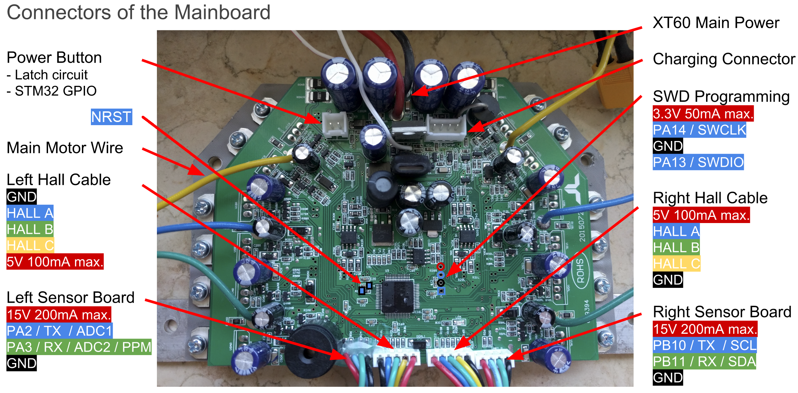
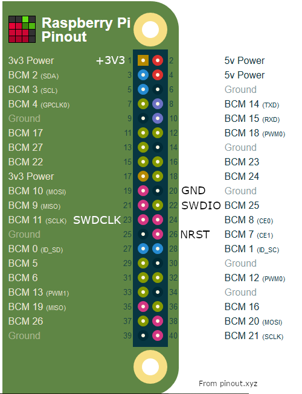

# Hoverboard firmware
This document is part of the hoverboard firmware documentation.

## Flashing
This document describes how to flash the firmware directly with Raspberry PI Zero.

### Hoverboard pinout
The hoverboard circuit board has the SWD (single wire debug) pins as a debug points 
next to the processor. You can see the pins in the following picture.



I've marked the pins with colors corresponding the pin function, from top to bottom: 
`+3.3V`, `SWCLK`, `GND`, `SWDIO`. The `+3.3V` should not be used, as it flows backwards 
through the power supply regulators and most likely breaks them! Use the main power supply 
(or charger?) when flashing.

In addition to the 3 necessary SWD pins (clock, data and ground) there is another pin that 
can/should be used: the reset pin. It has no test point but the connection can be found 
from the left side of the processor. `NRST` is on the right side of `C4` and on the left 
side of `R19`.

The reset pin might not be necessary, but my experience is that without using it during 
flashing/debugging, the processor might start up from wrong memory address which causes 
huge amount of unnecessary pain. I rather use the reset pin and know the state of the 
processor after flashing.

### Raspberry PI pinout
The same pins on the Raspberry PI zero are according to following image. These are not 
the default pins, but I ended up using these wafter trying a "native" interface which I 
could not get to work. I didn't change the wiring, I rather modified the "sysfsgpio" config 
that I got to work.



Basically just connect all the similarly named pins together. But do not connect the `+3.3V`!

### Configurations
[OpenOCD](http://openocd.org) is used for flashing. However, the stock OpenOCD on my Raspbian 
did not have the `sysfsgio` interface built in, so I had to rebuild OpenOCD from source, using 
`--enable-sysfsgpio` configure flag.

After that, copy the [sysfsgpio-raspberrypi.cfg](../OpenOCD/sysfsgpio-raspberrypi.cfg) to 
the interface folder of OpenOCD, in my system that was `/usr/local/share/openocd/scripts/interface/`.

Then, have the [openocd.cfg](../OpenOCD/openocd.cfg) in the same directory where you're going 
to run OpenOCD, and also have the firmware `hover.bin` in the same directory.

### Flashing
Launch OpenOCD by running
```
sudo openocd
```

It should find the processor and halt it.

Then you need to open telnet to interface with it:
```
telnet localhost 4444
```

in that you can enter commands. To unlock the chip on first flashing, enter
```
stm32f1x unlock 0
reset halt
```

then you can flash the firmware with
```
flash write_image erase build/hover.bin 0x8000000
reset
```
If you run just `reset` the board should start. You can also run `reset halt` to halt it.

If OpenOCD was running between flashings, run `reset halt` always before flashing. Also remember 
to keep the power button pressed, or use a jumper on the connector. Otherwise the processor may 
release the power supply during reset and/or flashing and everything will fail.

### Notes
There is some more documentation on the main readme on how to unlock the chip and so on. Those 
commands are run directly from OpenOCD command line, but I never got that to work, so I did 
this with telnet.

## Copyright
Copyright (C) 2019 Lauri Peltonen
