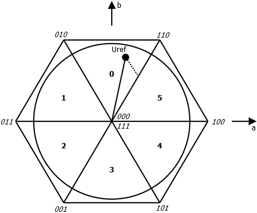
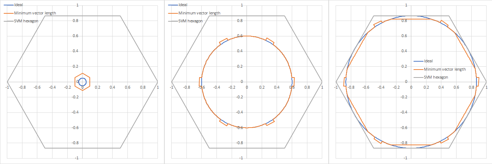
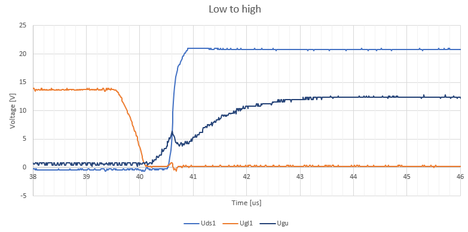
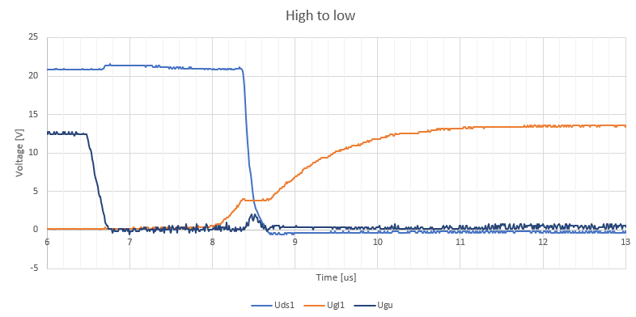
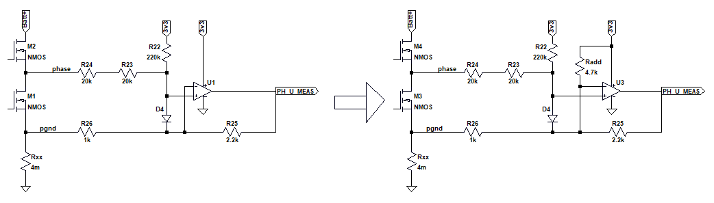
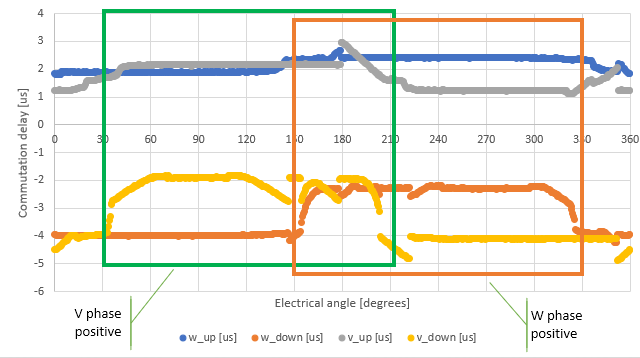

# Hoverboard firmware
This document is part of the hoverboard firmware documentation.

## Modulation
The modulation method used in the firmware is described in this document.

### BLDC modulation
In this chapter the original BLDC trapezoidal PWM scheme is described. The operation is 
analyzed from the NiklasFauth's source code.

The modulation is a trapezoidal modulation, in which one phase is not switching and 
the two others have positive (> 50 %) or negative (< 50 %) PWM. First, the hall sensors 
are used to determine the motor position and select which channels to use, according 
to following table.

| Sector | Hall A | Hall B | Hall C | Output A | Output B | Output C |
|--------|--------|--------|--------|----------|----------|----------|
| 0      | 1      | 1      | 0      | 0        | +        | -        |
| 1      | 0      | 1      | 0      | -        | +        | 0        |
| 2      | 0      | 1      | 1      | -        | 0        | +        |
| 3      | 0      | 0      | 1      | 0        | -        | +        |
| 4      | 1      | 0      | 1      | +        | -        | 0        |
| 5      | 1      | 0      | 0      | +        | 0        | -        |

The PWM duty cycle is set directly by the given (and low-pass filtered) speed reference.

This basically means that the motor applies a torque which is dependent on 
the requested speed reference, and as a result, the speed settles to a point 
in which losses (air drag, friction) equal the torque generated.

### SVM modulation
SVM (Space Vector Modulation) is the modulation scheme used in this firmware.

The space vector hexagon is seen in image below. The bold numbers inside the sectors 
correspond to the sector numbers used in the earlier BLDC modulation scheme. The oblique numbers 
at the corners is the output switch states, given in ABC order. It can be seen that for example 
at corners of sectors 0 and 1 the B phase is high (1), which is similar to the BLDC modulation where 
the B output was positive.



The given voltage vector `Uref` can be realized using the neighboring corners and one or both zero 
vectors. First, it is necessary to select the correct sector to know which vectors to use. The sector 
and vectors are selected according to following table.

| Sector |    Angle   | Zero 1 | Active 1 | Active 2 | Zero 2 |
|:------:|:----------:|:------:|:--------:|:--------:|:------:|
|    0   |  60...120  |   000  |    010   |    110   |   111  |
|    1   |  120...180 |   000  |    010   |    011   |   111  |
|    2   |  180...240 |   000  |    001   |    011   |   111  |
|    3   |  240...300 |   000  |    001   |    101   |   111  |
|    4   | 300..360/0 |   000  |    100   |    101   |   111  |
|    5   |   0...60   |   000  |    100   |    110   |   111  |

The modulation pattern is `Zero 1 -> Active 1 -> Active 2 -> Zero 2 -> Active 2 -> Active 1 -> Zero 1`. 
Active vectors are selected in such order that only one transistor needs to be switched to transit 
from one vector to another. The angle is the desired voltage vector angle, while amplitude only 
affects the vector times.

Knowing which vectors to use, vector times are calculated using
```
Ta1 = Ts * 2/sqrt(3) * M * sin(pi/3 - angle)
Ta2 = Ts * 2/sqrt(3) * M * sin(angle)
T0 = Ts - Ta1 - Ta2
```
Where `Ta1` and `Ta2` are active vector times and `T0` is the sum of the zero vector times. `M` is 
the modulation index, i.e. the voltage amplitude and `angle` is the desired voltage angle inside the 
sector, i.e. 0...60 degrees.

`Ta1` always references to the vector that is clockwise next to the reference, and `Ta2` to the one on 
the counter-cockwise side. According to the modulation table above, sometimes we wish to use first the 
clockwise one and sometimes the other. Thus it is necessary to swap `Ta1` and `Ta2` depending on the 
sector we are in, to achieve correct switching order and correct vector times.

The sectors during which we wish to use the counter-clockwise vector first and need to swap the times are
0, 2, and 4.

Since it is quite time consuming to calculate sinusoidal function, the value of `Ts * 2/sqrt(3) * sin(angle)` is 
pre-calculated into an array for 0...60 degrees angle. The `pi/3 - angle` is achieved by reading the 
array backwards. Since `Ts` is pre-calculated into the array, it is necessary to re-compute the array 
if switching frequency is changed.

Functions above require modulation index to be equal or smaller than `sqrt(3)/2=0.866`, which is the 
maximum radius of a circle that fits inside the SVM hexagon. In practice, the equations are normalized 
by dividing with that value, so that modulation index of one gives the maximum circle.

The modulator requires, as an input, the desired voltage vector length and angle, and as a result it 
gives out the switching instants of the three switches.


### Pulse width limitation
For current measurement purposes we wish to guarantee certain vector lengths, during which the current 
is sampled. As a result, we need to modify the calculated ideal vector times in such a way that we 
have proper vector lengths and also proper zero vector time, i.e. to keep the resulting vector as 
close to the reference as possible.

One method to do this limitation is to first calculate the ideal vectors, and then if we assume minimum 
pulse lengths `Tm0` for zero vector and `Tma` for active vector minimum length, we calculate
```
Tma2 = Ts - Tma - Tm0
T0err = max(T0 - Tm0, 0)

Ta1 = min(max(Ta1 - T0err/2), Tma2)
Ta2 = min(max(Ta2 - T0err/2), Tma2)
T0 = Ts - Ta1 - Ta2
```
This has the downside that the voltage is distorted in sector changes as well as with small or high modulation 
indices. Following figure shows how the actual voltage looks like compared to the ideal reference, with 3 different 
modulation indices: 0.05, 0.6 and 0.85 (note that in this case 0.866 is maximum linear region).



At low modulation index the active pulse length limitation, forcing the usage of two short active pulses, distorts 
the waveform. The same also affects sector changes where only one active vector would be needed.

At high modulation index the forced usage of zero pulse distorts the voltage at the center of sectors where 
there would be no need for zero vector.

The limitations mentioned above are caused mainly by requiring the vectors for current measurement reasons. If phase 
current measurement is not needed (or its accuracy can be decreased), the pulse limitations may not be needed and 
more accurate voltage generated.


### Commutation delay
One thing that I noticed when running the space vector modulator without any control loop was that the voltage quality was very 
poor and as a result the motor would not run nicely, even without any pulse width limitations applied. I figured this 
must be due to the commutation delays distorting the short pulses generated by SVM.

First I measured the commutation delays without any load connected. In the following figures the gate voltages of lower 
and upper transistors is drawn together with the drain-source voltage of the lower transistor. First transition from 
lower transistor conducting to upper transistor conducting is shown.



The next figure shows transition from upper transistor conducting to lower transistor conducting.



During the measurements, the dead time of the PWM was set to 500 ns.

As can be seen, the transistor turn off is very fast. Turn on, on the other hand, is very slow and gate voltage 
rises only gradually. In this case because there was no load, the voltage changes state only when the on-turning 
transistor's gate voltage reaches the miller plateau at about 4 volts.

For some reason the events are not symmetric at all. It seems like there is a significantly more delay when going from 
high to low than other way around. I have not yet studied why this is.

An automatic dead time compensation method is started in branch [deadtime](https://github.com/zanppa/hoverboard-firmware/tree/deadtime).
In that branch the phase voltage measurement pins, `PA0`, `PC3`, `PC4`, and `PC5`, are configured as digital inputs and 
are set to generate interrupts (EXTI). The interrupt stores the current counter value of the PWM timer, and knowing when 
the output was supposed to change state (from the modulator), the commutation delay can easily be calculated.

The default phase voltage measurement lies somewhere between digital states 0 and 1 when phase voltage is zero, and for this
reason the EXTI does not quite work properly. It seems to always generate the up-going edge interrupt, but rarely 
generates the down-going edge. To overcome this, I modified the phase voltage circuit (temporarily) to shift the zero point 
down so that at 0 V the phase voltage measurement is definitely digital zero (less than 1 V or so). The modification is 
according to following figure, note the added `Radd` from op-amp negative input to +3.3V rail.



With this modification and SVM, it is possible to control the output voltage angle over the complete circle (electrical angles) 
and measure the commutation delay for going from low to high and vice versa. Next figure shows the results; for right motor 
the measurement is in phases V and W.



The blue and gray lines show the low-to-high delay while the orange and yellow and high-to-low. Since the PWM counter counts 
downwards during high-to-low transition, those commutation delays show as negative; it is really a delay.

Since the rotation speed was very slow, the current is in phase with the voltage. We can see that the low-to-high delay does 
not vary much but is typically around 2 us. The high-to-low depends highly on the current polarity, when the phase is positive 
the delay is about 2 us and when it is negative the delay is 4 us. It is expected that when current has certain polarity, 
current  immediately commutates to the other branch diode when the transistor is turned off. For the inverse polarity, the 
other  transistor must be turned on for the current to commutate from diode to it, and thus additional delay is introduced.

There are some jumps up and down in the measured values, which might be caused by the (other) interrupt priorities delaying 
the measurement, or other noise in the interrupt system, which is not very precise. Also, I would expect the delay length to be 
other way regarding the phase polarity, I probably need to double check those...


## Copyright
Copyright (C) 2019 Lauri Peltonen
