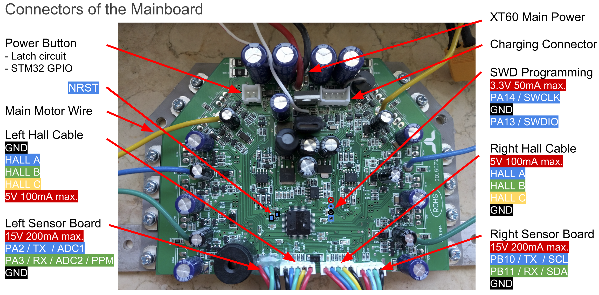

# hoverboard-firmware

This is a fork of TomTinkering's hoverboard-firmware-hack, which is a fork of NiklasFauth's hoverboard-firmware-hack.

Main purpose is to implement field oriented control with proper (sinusoidal) space vector modulation. At this point the basic 
concepts are working but need more testing and controller tuning.

Code here is heavily under development and most likely is not directly compatible with other people's version. And may break 
at any time without prior notice as I develop the features :)


## Roadmap
 - [ ] Add documentation
      - [x] [Pinouts](Docs/pinout.md)
      - [x] [Flashing](Docs/flash.md)
      - [ ] General documentation
      - [x] [Modulator documentation](Docs/modulation.md)
      - [x] [Current measurement](Docs/current_meas.md)
      - [ ] Control loops
 - [x] Add configs for Raspberry PI Zero W wireless flashing with OpenOCD
 - [x] Re-organize code
 - [x] Implement mandatory features
      - [x] Space vector modulation (requires more testing and reference chain)
      - [x] U/f control with IR compensation
      - [x] Better current measurement
           - [x] Lower branch transistor Rds,on measurement
           - [ ] Shunt measurement synched to active vectors
      - [x] FOC (field oriented control)
      - [x] Speed/torque control mode, reference chains
      - [x] Selectable reference source (modbus or analog inputs)
 - [ ] Additional features
      - [ ] Field weakening (automatic)
      - [ ] Current limiting
      - [x] Overcurrent trips
      - [x] Phase short circuit trip with shunt resistor
      - [x] Overvoltage and undervoltage limits
      - [x] Overvoltage and undervoltage trips/warnings
      - [ ] LED indications
      - [x] Buzzer indications
      - [x] Modbus Python examples
      - [x] [High-speed datalogger](Docs/datalogger.md)


## Turning on and off
In normal power button mode the power up and down sequence is following:
 - Press the power button down
 - Release the power button
 - Press the power button again quickly (in about half a second)
 - Keep the power button pressed for roughly a second

If the sequence was succesfull, power-up is indicated by a raising tone pattern and turn-off as a high-to-low tone pattern.

DC voltage (battery voltage) must be above the undervoltage warning/limit level, otherwise the system will not power up.

In emergency stop mode the power button directly indicates the power state. The board powers up when the button is pressed, 
and the button must be kept pressed during operation. Releasing the button immediately powers down the board.


## Notes
Main configuration is done in `Inc/config.h`. It should be checked carefully so that everything is configured properly. 
Some defaults are also set in `Src/cfgbus.c` (note also that storing those values to flash does not currently seem to work).

Testing should always start with BLDC mode on both motors, and torque control. That is the simplest and most reliable method.

SVM (U/f) control is very sensitive to motor parameters. Too low voltage for example leads to motor stall while 
too high a voltage causes unnecessarily high motor current.

In FOC torque control mode the speed can get very fast very quickly if there is no load on the motor. Be very 
careful when testing (or add some load to the motors) and apply sensible speed and PWM limits.

If you modify only header files, please run `touch Src/*` before building as the makefile does not detect changes 
in header files.

For flashing the power button must be pressed down. Flashing can happen even if the power-up sequence is not succesfull. 
As long as the power button is pressed, the board is powered.


## Fault tracing
There are several faults and warning that the system may generate. They are indicated with buzzer beeps (if enabled) and 
also via modbus in status and fault words.

 - Undervoltage fault: continuous low frequency tone
 - Undervoltage warning/limit: fast low frequency beeping: `B_B_B_B_B_B_B_B_`
 - Overvoltage warning/limiy: fast high frequency beeping: `B_B_B_B_B_B_B_B_`
 - Overvoltage fault: continuous high frequency tone
 - Overspeed warning/limit: two beeps with two tones:  `B_B___B_B___`
 - Overspeed fault: three beeps with two tones: `B_B_B__B_B_B__`
 - Overcurrent fault: slow beeps with two tone: `BB___BB___BB___`


## TomTinkering's changes
The goal is to make the board more configurable without requiring reprogramming for every setting, 
and to allow controller the board over different interfaces.

Current state:
 - [x] implemented dma/interrupt based UART2/3 RX/TX (see uart.h/c)
 - [x] implemented simple modbus slave (supports commands 0x3(read) and ox10(write). Works with open-source QtModMaster tool
 - [x] implemented modbus wrapper to allow user-defined variables to be accessed in code and over modbus. 
 - [x] Built GUI to talk to modbus-wrapper and allow plotting/changing and storing device settings
 - [x] Added Tacho/Speed signals for both motors
 - [x] cleaned code from some hacks/features. Some will be re-added later
      - [x] removed I2C/ADC/PWM control. This will be re-integrated soon
      - [x] clean up BLDC ADC handler, now more efficient, and only dealing with motors
      - [x] no more delays in code, but rather non-blocking Tick() based updates
      - [x] disabled buzzer, man I hate buzzers
 - [x] implement flash-eeprom emulation to store settings in bvm memory
      
      
Coming soon:
  - [ ] selectable control method. (Uart,I2C,ADC,PPM)
  

## NiklasFauth's comments

This repo contains open source firmware for generic Hoverboard Mainboards.
The firmware you can find here allows you to use your Hoverboard Hardware (like the Mainboard, Motors and Battery) for cool projects like driving armchairs, person-tracking transportation robots and every other application you can imagine that requires controlling the Motors.

If you want an overview of what you can do with this firmware, here is a ~40min video of a talk about this project:
https://media.ccc.de/v/gpn18-95-howto-moving-objects

---

## Build Instructions
Here are detailed build instructions for some finished projects.

---

### Hardware


The original Hardware supports two 4-pin cables that originally were connected to the two sensor boards. They break out GND, 12/15V and USART2&3 of the Hoverboard mainboard.
Both USART2 & 3 can be used for UART and I2C, PA2&3 can be used as 12bit ADCs.

The reverse-engineered schematics of the mainboard can be found here:
http://vocke.tv/lib/exe/fetch.php?media=20150722_hoverboard_sch.pdf

---

### Flashing
Build requirements (package names as in debian/devuan)
```
gcc-arm-none-eabi >= 7
libnewlib-arm-none-eabi >= 3.1.0
```

To build the firmware, type
```
make
``` 
Make sure you have specified your gcc-arm-none-eabi binary location in the Makefile ("PREFIX = ...") Official gnu toolchain with latest version: https://developer.arm.com/open-source/gnu-toolchain/gnu-rm/downloads.

Right next to the STM32, there is a debugging header with GND, 3V3, SWDIO and SWCLK. Connect GND, SWDIO and SWCLK to your SWD programmer, like the ST-Link found on many STM devboards.

Do not power the mainboard from the 3.3V of your programmer! This has already killed multiple mainboards.

Make sure you hold the powerbutton or connect a jumper to the power button pins while flashing the firmware, as the STM might release the power latch and switches itself off during flashing. Battery > 36V have to be connected while flashing.

To flash the STM32, use the ST-Flash utility (https://github.com/texane/stlink).

If you never flashed your mainboard before, the STM is probably locked. To unlock the flash, use the following OpenOCD command:
```
openocd -f interface/stlink-v2.cfg -f target/stm32f1x.cfg -c init -c "reset halt" -c "stm32f1x unlock 0"
```

If that does not work:
```
openocd -f interface/stlink-v2.cfg -f target/stm32f1x.cfg -c init -c "reset halt" -c "mww 0x40022004 0x45670123" -c "mww 0x40022004 0xCDEF89AB" -c "mww 0x40022008 0x45670123" -c "mww 0x40022008 0xCDEF89AB" -c "mww 0x40022010 0x220" -c "mww 0x40022010 0x260" -c "sleep 100" -c "mww 0x40022010 0x230" -c "mwh 0x1ffff800 0x5AA5" -c "sleep 1000" -c "mww 0x40022010 0x2220" -c "sleep 100" -c "mdw 0x40022010" -c "mdw 0x4002201c" -c "mdw 0x1ffff800" -c targets -c "halt" -c "stm32f1x unlock 0"
```
```
openocd -f interface/stlink-v2.cfg -f target/stm32f1x.cfg -c init -c "reset halt" -c "mww 0x40022004 0x45670123" -c "mww 0x40022004 0xCDEF89AB" -c "mww 0x40022008 0x45670123" -c "mww 0x40022008 0xCDEF89AB" -c targets -c "halt" -c "stm32f1x unlock 0"
```
Or use the Windows ST-Link utility.

Then you can simply flash the firmware:
```
st-flash --reset write build/hover.bin 0x8000000
```
or
```
openocd -f interface/stlink-v2.cfg -f target/stm32f1x.cfg -c flash "write_image erase build/hover.bin 0x8000000"
```

---
## Troubleshooting
First, check that power is connected and voltage is >36V while flashing.
If the board draws more than 100mA in idle, it's probably broken.

If the motors do something, but don't rotate smooth and quietly, try to use an alternative phase mapping. Usually, color-correct mapping (blue to blue, green to green, yellow to yellow) works fine. However, some hoverboards have a different layout then others, and this might be the reason your motor isn't spinning.

~~Nunchuck not working: Use the right one of the 2 types of nunchucks. Use i2c pullups.~~

~~Nunchuck or PPM working bad: The i2c bus and PPM signal are very sensitive to emv distortions of the motor controller. They get stronger the faster you are. Keep cables short, use shielded cable, use ferrits, stabilize voltage in nunchuck or reviever, add i2c pullups. To many errors leads to very high accelerations which triggers the protection board within the battery to shut everything down.~~

Most robust way for input is to use the ADC and potis. It works well even on 1m unshielded cable. Solder ~100k Ohm resistors between ADC-inputs and gnd directly on the mainboard. Use potis as pullups to 3.3V.

---


## Examples and links

Have a look at the config.h in the Inc directory. That's where you configure to firmware to match your project.
Currently supported: ~~Wii Nunchuck̃~~, analog potentiometer, modbus ~~and PPM-Sum signal from a RC remote~~.
~~A good example of control via UART, eg. from an Arduino or raspberryPi, can be found here:~~
https://github.com/p-h-a-i-l/hoverboard-firmware-hack

If you need additional features like a boost button, have a look at the while(1) loop in the main.c

### Hoverboardhack for AT32F403RCT6 based mainboards

* [https://github.com/cloidnerux/hoverboard-firmware-hack](https://github.com/cloidnerux/hoverboard-firmware-hack)

### Online Compiler

* [RoboDurdens awesome](https://github.com/RoboDurden) online compiler: [https://pionierland.de/hoverhack/](https://pionierland.de/hoverhack/) 

### Additional Hardware

* [breakout/interconnect boards](https://github.com/Jan--Henrik/hoverboard-breakout)  Breakout/Interconnection boards for hoverboard hacking.

### Projects based on it
* [Bidirectional UART communication](https://github.com/RoboDurden/hoverboard-firmware-hack) with Arduino example code
* [bobbycar-optimized firmware](https://github.com/larsmm/hoverboard-firmware-hack-bbcar)  based on this one with driving modes, acceleration ramps and some other features
* [wheel chair](https://github.com/Lahorde/steer_speed_ctrl) controlled with a joystick or using a CC2650 sensortag to control it over  bluetooth with pitch/roll.
* [TranspOtterNG](https://github.com/Jan--Henrik/transpOtterNG) TranspOtter is an open source semi self driving transportation platform based on hoverboard hardware
* [BiPropellant](https://github.com/bipropellant) - fork which focusses on reliable machine control, but also retains HoverBoard functionality if desired.
